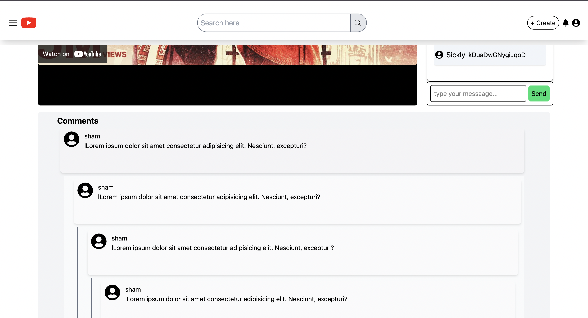

# 📺 YouTube Clone

> ⚠️ **Note:** This project is created for **learning and study purposes**.
> The auto search suggestion works if you add the CORS extensiion in the browser otherwise it will not as i dont intend to create a backend to resolve the issue right now.

A fully responsive YouTube clone built using **React**, **Redux**, and **Tailwind CSS**, with core features like video browsing, watching, live chat simulation, nested comments, and smart search suggestions.


---

## 🚀 Project Structure

- **Header**
  - Logo
  - Search input with suggestions
  - Create, Notification, and User icons

- **Body**
  - Sidebar navigation
  - Main container for videos

- **MainContainer**
  - Button list for filters
  - `VideoCard` list populated via YouTube API

- **WatchPage**
  - Displays a selected video with:
    - Embedded video iframe
    - Live Chat
    - Nested comments

---

## 📦 Features Breakdown

### 🔹 VideoContainer

- Fetches videos using the YouTube API (stored in `utils/constants.js`)
- Parses the response as JSON
- Dispatches an action to store videos in the Redux store
- Accesses videos using `useSelector`
- Renders each video using `map()` in `VideoCard`
- Makes each `VideoCard` clickable using a `Link`:
  ```jsx
  return <Link to={"/watch?v=" + video.id} key={id}><VideoCard info={video} /></Link>

### 🔹 Watch Video Page
Uses useSearchParams() to extract video ID from the URL

Embeds the video using an <iframe>

### 🔹 HOC (Higher Order Component)
Demonstrates a simple HOC pattern

A HOC is a function that takes a component and returns a new enhanced component

Example: Wrapped a component with a border for learning purposes

### 🔹 Auto Search Suggestions
Implements live auto-suggestions using YouTube's search API

Debouncing added to delay API calls (improves performance)

Suggestion results rendered dynamically using map()

### 🔹 Smart Caching with Redux
Created a searchSlice in Redux to store previous queries

On repeated search (e.g. "iPhone"), the app:

Avoids duplicate API calls

Uses cached data from Redux

Combines debouncing + caching for efficient UX

### 🔹 Nested Comments (Recursive)
Comments can have replies inside replies (infinite depth)

Implemented using a recursive CommentList component

Example structure:

[
  {
    name: "User",
    text: "This is a comment",
    replies: [ ...nested replies... ]
  }
]

- 💬 Live Chat
Challenges:

Continuously receive live messages

Update UI without freezing

- Implemented using:

    API Polling with setInterval (for simulation)

    Random message generator + random usernames

    UI rendered using flex-col-reverse to simulate YouTube’s bottom-to-top message flow

    Input box allows user to send chat messages

- Optimizations
    Efficient state management using Redux

    Live Chat auto-scrolls and removes old messages (like YouTube)

    App remains performant even under heavy comment loads

🖼️ Preview
Add the following image to ./public/yt_01.png




📚 Technologies Used
    - React

    - Redux Toolkit

    - React Router

    - Tailwind CSS

    - YouTube API

    - JavaScript (ES6+)

📌 To Do
 Add actual live chat via WebSocket

 Add dark mode

 Improve mobile UI

🧑‍💻 Author
Shamily — built this project for learning and practice.

📄 License
MIT — use freely for learning purposes.


